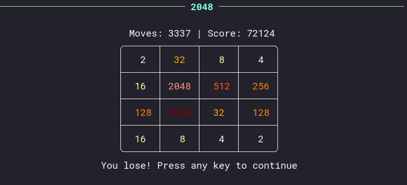

# 2048 cli
A small clone of [2048](https://play2048.co/). In it, the player moves numbered blocks in a 4x4 grid, combining them to create a block with the number 2048. 
The challenge lies in the strategy to avoid running out of moves possible. 
The game ends when the grid is full and there are no more combinations available


In this project, I also try to develop an A.I. using the Monte Carlo method to try to achieve the best possible score.

## Installation
Install with pip or your favorite PyPI package manager
```bash
$ pipx install 2048-cli
```
Then run the following command in the terminal
```bash
$ 2048-cli
```

## Modes
### Single Player
In single player mode, you command the moves with the aim of achieving the highest possible score.

<div align="center">


</div>

### AI Playing
In AI game mode, moves will be generated using a Monte Carlo search algorithm.

<div align="center">



</div>
