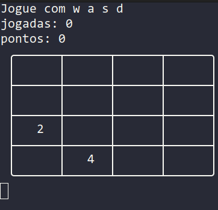
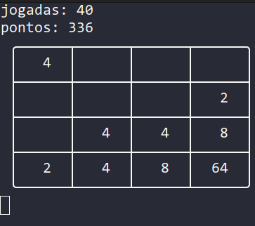

# Jogo 2048 para Terminal com algoritmo de Monte-Carlo
## Introdução
Nesse projeto, desenvolvi uma réplica do jogo
2048 para terminal em Python.

## Requisitos
* Ter o Python instalado na versão 3.10.4 (durante o desenvolvimento, utilizei a versão 3.10.4, então não garanto que versões anteriores funcionem);
    * Ter as seguintes bibliotecas no Python:
        * numpy==1.21.6
## Como utilizar
### Instalando as bibliotecas necessárias
```bash
$ git clone https://github.com/gbPagano/2048-game-for-terminal
$ cd 2048-game-for-terminal
$ pip install -r requirements.txt
```
### Executando o jogo

```bash
$ python 2048.py
```
---
Utilize as teclas "w,a,s,d" no input do terminal para realizar as jogadas.



